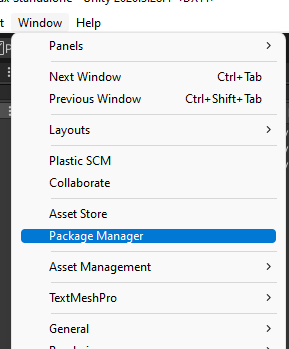
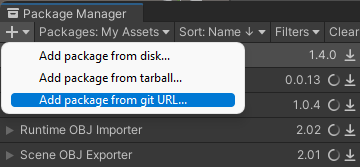
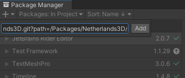
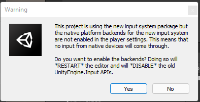
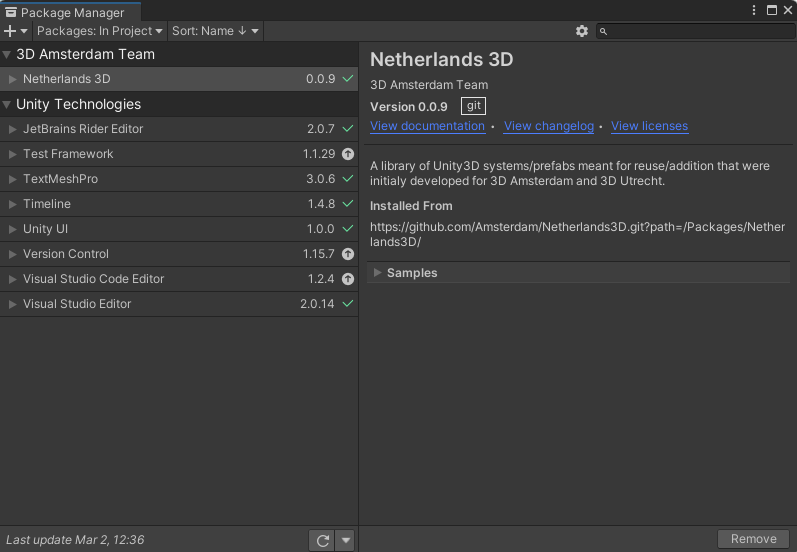
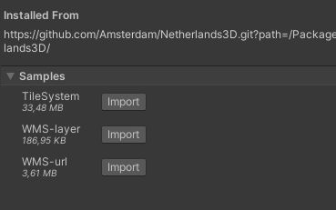
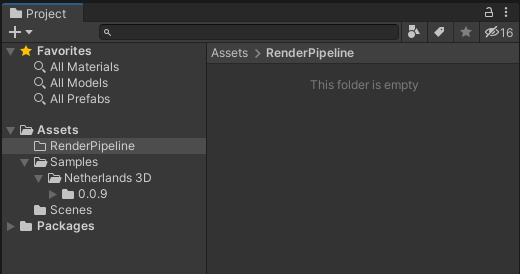
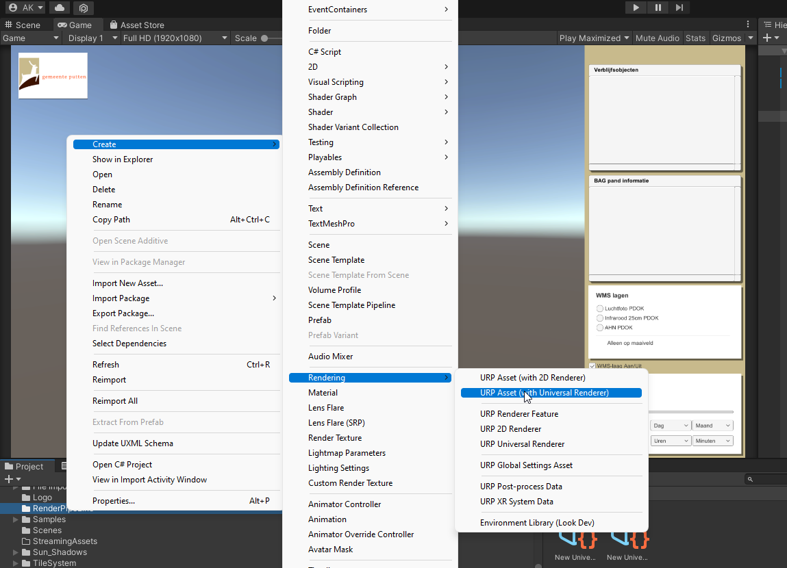
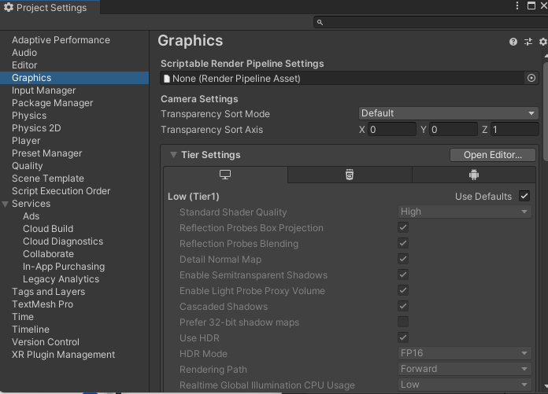

# Beginnen met Netherlands3D in Unity

Met deze gids leer je als nieuwe Netherlands3D gebruiker of ontwikkelaar het volgende: 
* De installatie van het versiebeheersysteem Git.
* De installatie van Unity. 
* Het binnenhalen van de Netherlands3D packages.
* Het opzetten en configureren van een Netherlands3D project in Unity.
## Systeemeisen

Om de Unity editor te gebruiken raden wij de volgende systeem- en hardwarespecificaties aan: 
* Windows 10 of hoger (in ieder geval 64 bits).
* Een i5 processor of hoger
* Een externe GPU (grafische kaart)
* Een muis voor makkelijke navigatie in de game scene. 

## Git installeren

Om Netherlands3D packages makkelijk te installeren, raden wij het gebruik van Git aan. Download Git vanaf https://gitforwindows.org/.
Kies voor een installatie met de standaard opties aangevinkt en herstart je lokale machine nadat de installatie is afgerond

Je beschikt nu over een versiebeheersysteem waarmee je het Netherlands3D project kan importeren op je lokale machine. 

## Unity installeren

Download en installeer Unity3D via <https://unity.com/download>

Je download daarmee de 'Unity Hub'. Vanuit deze Hub kan je verschillende versies van Unity downloaden.

'Sign in' met een bestaand Unity account, of maak eerst een nieuw account aan via 'Create account' en doe dan 'Sign in'

Ga eventueel akkoord met het activeren van een 'FREE personal license'.

Kies in het 'Install Unity Editor' scherm rechtsonderin 'skip installation'. Wij willen namelijk een specifieke versie gaan installeren.

Installeer via 'Installs / Install Editor' de LTS (long term service) versie 2021.3.6f1


Maak na het installeren in de Hub een nieuw Unity project aan via 'Projects / New Project' en kies als template '3D Core'.

Kies een naam voor je project en de locatie op je computer


Het project wordt vervolgens automatisch geopend in Unity.

## Netherlands3D packages beschikbaar maken

Met Netherlands3D worden alle packages gepubliceerd op [OpenUPM](https://openupm.com), een Unity Package 
Registry voor Open Source packages.

OpenUPM raadt aan om hun CLI tool te gebruiken om packages mee te installeren, maar het is ook mogelijk om deze
als Scoped Registry toe te voegen middels de volgende stappen:

 
* open Edit/Project Settings/Package Manager.
* Voeg een nieuwe Scoped Registry toe, of bewerk de bestaande OpenUPM verwijzing.
  ```
  Name: package.openupm.com
  URL: https://package.openupm.com
  Scope(s): eu.netherlands3d
  ```
* Klik op Save (of Apply)

Om een overzicht te zien van alle packages die je op deze manier kan installeren volg je deze stappen:

* Open de Package Manager
* In de dropdown `Packages: In Project`, selecteer `My Registries`

In dit overzicht staan alle packages die beschikbaar vanuit Netherlands3D, en andere Scopes mocht je 
die ingesteld hebben staan.

## Netherlands3D opzetten

Open in Unity de package-manager (window package manager)



Klik op het + icoon in de linkerbovenhoek, kies voor "Add package from git URL", vul daar in "<https://github.com/Amsterdam/Netherlands3D.git?path=/Packages/Netherlands3D/>" en klik op "Add".





Unity gaat nu even iets voor zichzelf doen.

Er komt een melding om de editor opnieuw te starten, klik op Yes




Unity herstart nu en laat daarna, als alles goed gegaan is, de package Netherlands3D zien in de package-manager.



Onder het kopje "Samples" staat een lijst met pakketjes, dit zijn de modules in netherlands3D die je kunt toevoegen aan je eigen project.



We beginnen met het TileSystem. Dit is de module die het 3D-model van de stad laat zien. 
Klik hiervoor op het knopje "Import" naast "TileSystem".

Unity heeft nu in de Assets map een mapje "Samples" aangemaakt met daarin een mapje "Netherlands3D" en daarin een mapje met een
versienummer. In dit mapje staat alles wat je nodig hebt om het 3D-model van de stad in het project te laten zien.

Nu maken we in de Assets map een nieuwe map aan met de naam "RenderPipeline" (let op de hoofdletters).




Geef een rechter-muisklik op deze nieuwe map en kies via create > rendering > voor URP Asset (with Universal Renderer).



Unity geeft je nu de optie om de naam van dit nieuwe bestand te wijzigen, maar dat is niet nodig. Geef een enter om de voorgestelde naam te accepteren. Direct na het accepteren van de bestandnaam maakt Unity nog een tweede bestand aan.


De laatste handeling die we moeten doen is aan Unity vertellen dat deze, zojuist gemaakt bestandjes, gebruikt moeten worden door de Universal
Render Pipeline. Dit doen we in de project Settings ( Edit project Settings. In het project settings menu kiezen we in de linker kolom voor "Graphics".)



Boven in het Graphicsmenu klikken we op het rondje naast het invulveld bij Scriptable Render Pipeline Settings.


In het menuutje dat opent dubbelklikken we op het bestandje dat we zojuist hebben aangemaakt.


