# Basis in een uur

Naast het beginnen vanaf een nieuw project om daar samples van de package in te laden, bieden we nu ook een basis layout aan, waar de volgende samples uit de package al in zitten:

- Freecamera
- Sun
- Tilehandler
- BAGBuildingDataLoader
- BAGResidenceDataLoader
- wmsLayerManager
- Eenvoudige layout met canvas Group voor automatisch uitlijnen vensters
- plek voor eigen logo

## Repository opzetten

Hiervoor heb je een git-client nodig, zoals [tortoise](https://tortoisegit.org/download/) (uitgebreid) of [Github Desktop](https://desktop.github.com/) (eenvoudig). download en installeer één van deze en ga naar de website waar je repositories kan maken (in dit geval Gitlab).

Maak een nieuwe repository aan.

*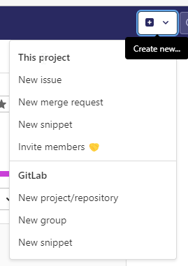*

*New project/repository*

Klik op blank project.

**

Vul hier een project naam en andere gegevens in....let op dat je in ieder geval een README file aanvinkt. Public of private is een eigen keus, maar de beste is natuurlijk public (om deze reden is Netherlands 3D ook public).

*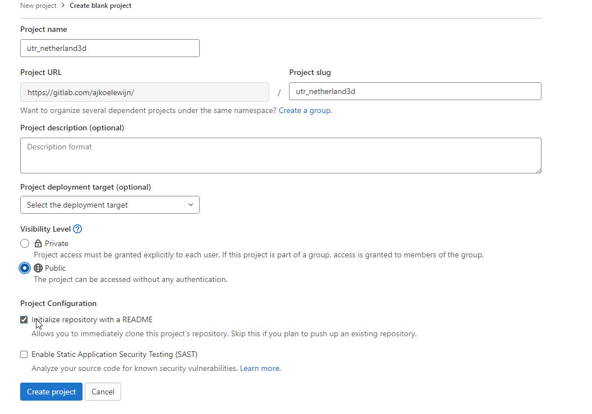*

Klik op create project en we zijn zover dat we de (cloud) omgeving kunnen gaan clonen naar je lokale machine.

*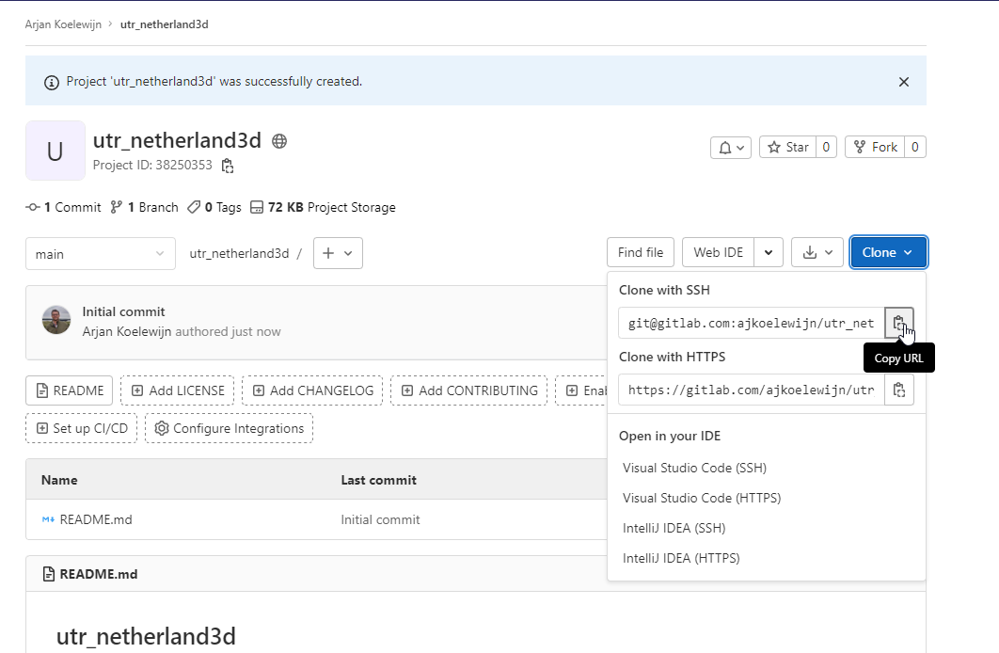*

In mijn geval gebruik in de SSH versie, omdat ik een Putty-key geïnstalleerd heb (extra beveiligingssleutel, zodat je weet dat je alleen van deze site iets up- of download). Klik op "copy URL" en ga naar een verkenner in windows op de plek waar je de lokale repository wilt plaatsen.

"*Deze handleiding volgt de Tortoise manier*"

Klik met de rechtermuisknop op je verkenner en kies bij Tortoise voor "clone"

**

en stel de juiste namen in het venster in. "*omdat ik SSH gebruik heb ik hier load Putty Key aangevinkt*"

**

klik op OK en de lokale repository wordt gebouwd.

Ga naar deze website [Gitlab]([https://gitlab.com/ajkoelewijn/nwv/-/tree/main/noordwestveluwe) (donor repository) en klik op download source code.

*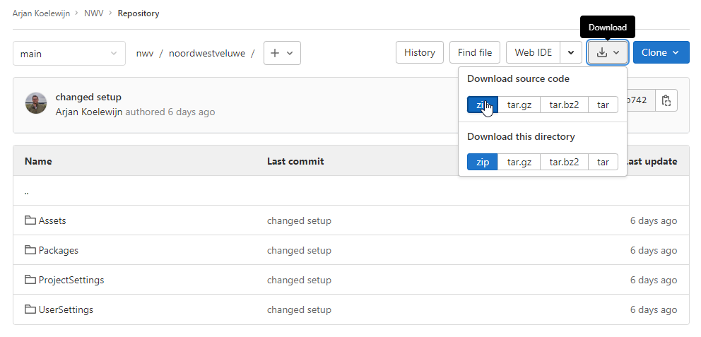*

Pak de inhoud van map "nwv-main" uit in de map utr_netherland3d en ga naar de map in verkenner.

Vanaf nu wordt het interessant.

"*Wat we nu gaan doen is de computer vertellen (aan de hand van een eerder gemaakte repository die we als donor gebruiken) welke mappen/bestanden wel en niet meegaan naar de online omgeving. Dit scheelt heel veel tijd en MB's. Geen zorgen dit gaat alleen om bestanden die Unity nodig heeft om te draaien, niet voor wijzigingen in het project.*"

Allereerst voegen we het bestand ".gitignore" toe aan de cloud repositiory.

"*LET OP! Deze handeling is de basis van het werken met Repositories.*"

Ga naar de repository (in verkenner) en zoek met rechtermuisknop naar "tortoise" en "commit"

*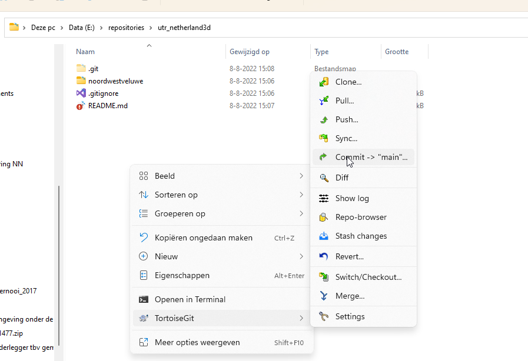*

voeg een message toe (anders kan je niet committen) en klik met rechtermuis op gitignore om het bestand aan de repo toe te voegen.

*"Het bestand "README.md" wordt direct meegenomen, omdat deze al in de repository bestond en is gewijzigd bij het kopiëren van de data uit de donormap."*

**

Klik vervolgens op op commit en daarna op push om het bestandje ook daarwerkelijk te uploaden.

**

Klik op ok in het volgende venster. "Local" en "Remote" staan allebei op main.

*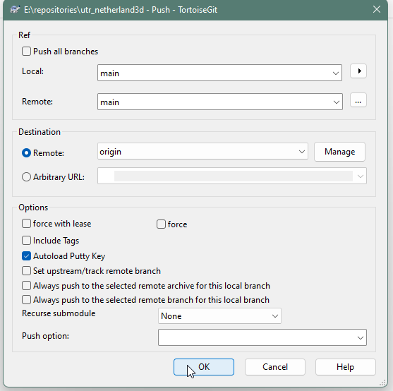*

"*commit is zeg maar, het toevoegen van bestanden aan een database en push en pull zijn commando's voor het up- en downloaden van bestanden die in de database voorkomen*"

## Project laden met data donor repository

Nu gaan we een nieuw project maken in Unity hub.

Maak na het installeren in de Hub een nieuw Unity project aan via 'Projects / New Project' en kies als template '3D (URP) Core'.

Kies de eerder gemaakte map voor de repository basis.

*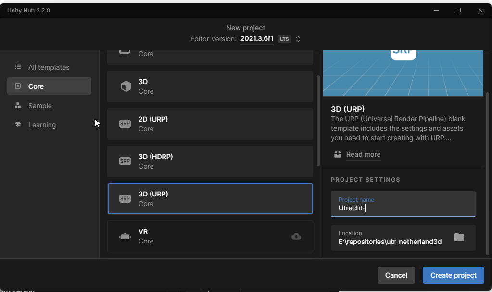*

Het project wordt vervolgens automatisch geopend in Unity.

Nu kunnen we de mappen "Assets", "Packages", "ProjectSettings" en "UserSettings" kopiëren uit de zip file naar de project map.

*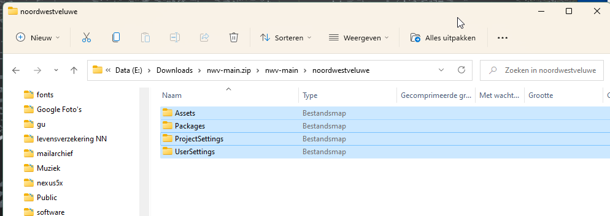*

**

Ga weer naar de Unity omgeving en zoek in de scene map naar de scene NWV. Open deze en klik met de rechtermuis op de naam in de Hierarchy en kies voor "Save Scene As" kies een naam (in dit geval Utrecht) en zet de Scene in de map "Scenes"

**

Nu kan de donorscene weggegooid worden.

*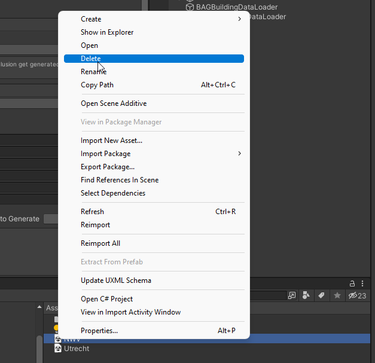*

Controleer of de scene werkt door op play te drukken. Er verschijnen dan tegels van NoordWestVeluwe, maar dat fixen we in de volgende paragraaf. Sluit de play mode weer af.

De enige stap is nog om lighting instellingen goed te zetten.

Klik op "Window" en "Rendering" en kies voor "lighting"

*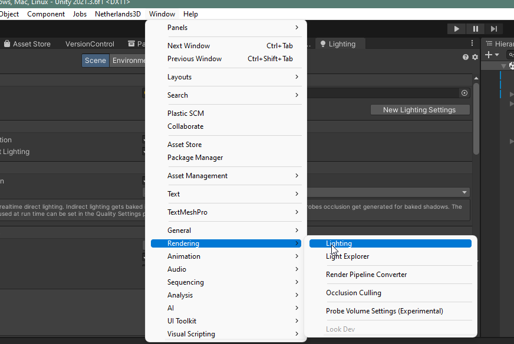*

Kies daarna voor "New Lighting Settings". Unity maakt dan een light setting aan die gebruikt wordt in de playmode.

*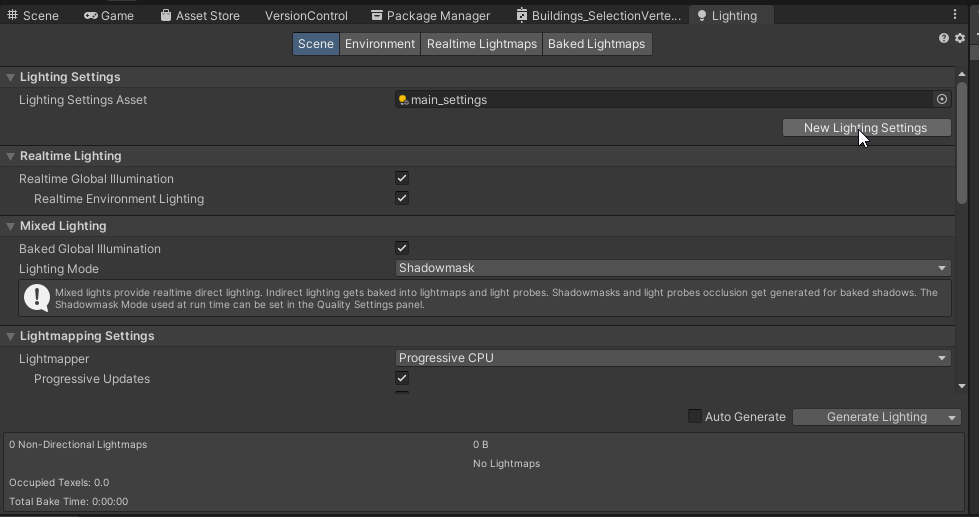*

Als je dit hebt gedaan klik dan op het tabje "Environment"

*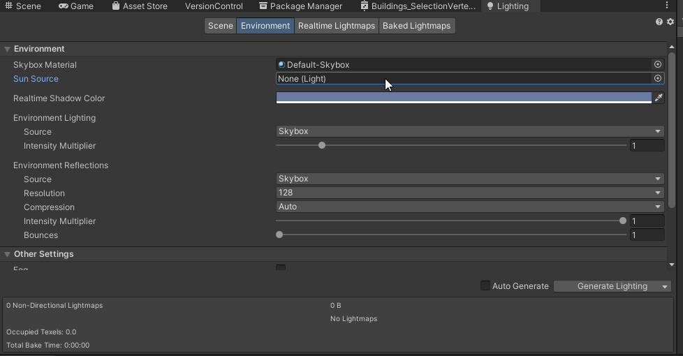*

Klik op het rondje rechts van "Sun Source" en kies in "Scene" voor "Directional Light"

**

## Eigen Data koppelen

De scene werkt nu met gegevens voor NoordwestVeluwe, maar je wilt natuurlijk eigen data koppelen. Hiervoor kunnen we weer gebruik maken van de handleiding [Datakoppelen.md](https://github.com/Amsterdam/Netherlands3D/blob/main/PackageUserManual/Dutch/DataKoppelen.md)

