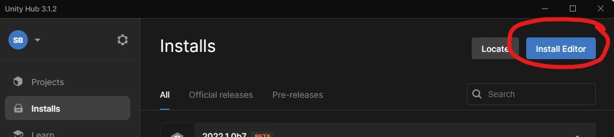

# Installatie

Met deze gids leer je als nieuwe Netherlands3D gebruiker of ontwikkelaar het volgende: 

* De installatie van het versiebeheersysteem Git.
* De installatie van Unity. 
* Het binnenhalen van de Netherlands3D packages.
* Het opzetten en configureren van een Netherlands3D project in Unity.

## Systeemeisen

Om de Unity editor te gebruiken raden wij de volgende systeem- en hardwarespecificaties aan:

* Windows 10 of hoger (in ieder geval 64 bits).
* Een i5 processor die vergelijkbaar of hoger is.
* Een externe GPU (grafische kaart).
* Een muis voor makkelijke navigatie in de game scene. 

## Git installeren

Om Netherlands3D packages makkelijk te installeren, raden wij het gebruik van Git aan. Download Git vanaf https://gitforwindows.org/.
Kies voor een installatie met de standaard opties aangevinkt en herstart je lokale machine nadat de installatie is afgerond

Je beschikt nu over een versiebeheersysteem waarmee je het Netherlands3D project kan importeren op je lokale machine. 

## Unity installeren

Download en installeer Unity3D via <https://unity.com/download>

Je download daarmee de 'Unity Hub'. Vanuit deze Hub kan je verschillende versies van Unity downloaden.

'Sign in' met een bestaand Unity account, of maak eerst een nieuw account aan via 'Create account' en doe dan 'Sign in'

Ga eventueel akkoord met het activeren van een 'FREE personal license'.

Kies in het 'Install Unity Editor' scherm rechtsonderin 'skip installation'. Wij willen namelijk een specifieke versie gaan installeren.

Installeer via 'Installs / Install Editor' de LTS (long term service) [versie 2022.2.18f1](https://unity.com/releases/editor/whats-new/2022.2.18). 

Je beschikt nu over een Unity Editor distributie waarmee je Unity projecten kan aanmaken en wijzigen. 

