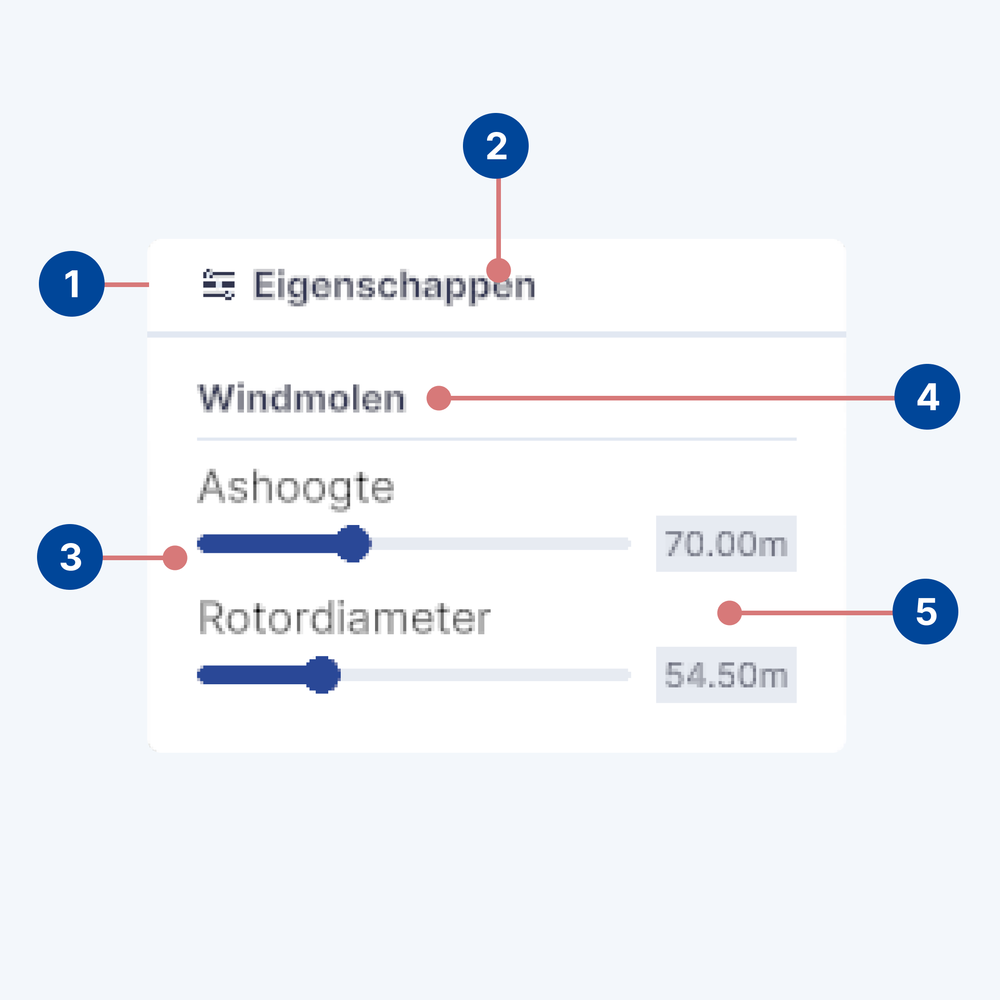

# Properties

## Usage

The "Properties" block in Netherlands3D serves as a critical interface element, allowing users to interact with and
modify the attributes of various layers within the application. This documentation provides insights into the design
considerations and implementation strategies for this block, ensuring a seamless integration within the Netherlands3D
platform.

This block enables users to access and adjust the transformation properties (position, rotation, scale) of selected 3D
objects or layers. Additionally, it provides access to specific attributes for certain objects, such as Windmills, which
may include properties like axis height or rotor diameter.

<figure markdown="span">
  
  <figcaption>A screenshot of a windmill with an open properties panel</figcaption>
</figure>

## Anatomy

<figure markdown="span">
    
  <figcaption>Anatomical breakdown of the properties block</figcaption>
</figure>

The Properties panel is constructed using a Card component, organized into several key areas for intuitive
user interaction:

1. [Card](../components/cards.md): The overarching container for the Properties panel, designed for clarity and cohesion.
2. [Card Header](../components/cards.md): Displays the Properties icon and the term "Eigenschappen," indicating the
   panel's purpose.
3. Section: Each layer or object type, such as Windmills, has its dedicated section within the card.
4. Section Header: Identifies the specific layer or object type, e.g., "Windmolen" for Windmills, guiding users to the
   relevant properties.
5. Section Content: Contains form elements for adjusting the specific properties of the selected layer or object. This
   area is designed for direct interaction, allowing users to modify attributes like axis height or rotor diameter.

## Design Principles

* **Clarity**: The use of a card-based layout ensures that the Properties panel is easily navigable and understandable,
  with distinct sections for different layers or objects.
* **Consistency**: Maintaining a uniform structure across different sections ensures that users have a cohesive
  experience, regardless of the variety of objects or layers they interact with.
* **Immediate Feedback**: Interactions within the Properties panel are designed to provide immediate visual feedback in
  the Netherlands3D environment, emphasizing the panel's role in direct manipulation of objects and layers.

## Interaction

Users interact with the Properties panel by selecting an object or layer within the Netherlands3D platform, and clicking
on the properties button with that layer. 

Upon opening, the panel updates to display the relevant sections for the chosen item. Adjustments made within the form 
elements of a section are immediately applied, allowing users to see the effects of their changes in real-time. This 
design supports a tactile and intuitive experience, encouraging exploration and modification within the digital twin 
environment.
